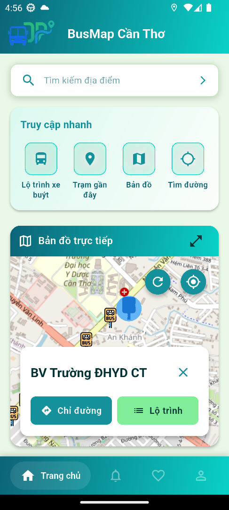

# BusMap Cần Thơ

A Flutter application that helps people in Cần Thơ look up public bus routes, find nearby stops, plan optimal trips, and follow real‑time bus positions. The project is built with Clean Architecture, strong layering, and production‑ready tooling. It was originally developed as an academic project and is now open for learning and contribution.

## Features
- Interactive map: visualize stops, routes, and live bus markers (Google Maps and OpenStreetMap via `google_maps_flutter` and `flutter_map`).
- Smart search: search by route number/name or stop name/ID; recent history.
- Route details: outbound/inbound directions, stop list, operating hours, fares, and operator info.
- Real‑time bus tracking: live locations streamed via Supabase Realtime (simulated data provided for development).
- Directions and trip planning: optimal path between two points with walking segments and ETA (OSRM).
- Favorites: quick access to Home/School/Company and frequently used routes/stops.
- Notifications: local notifications (and approaching‑bus alerts in progress).
- Accounts: Google sign‑in, profile, and password management.
- Bilingual UI: Vietnamese and English via Easy Localization.

## Architecture & Tech Stack
- Clean Architecture
  - Presentation: Flutter UI with BLoC/Cubit, GoRouter navigation.
  - Domain: entities and use cases only; framework‑free.
  - Data: repositories, models, and remote/local data sources.
- Dependency Injection: `get_it` + `injectable` (code generation).
- Backend: Supabase (Auth, Postgres, Realtime streams).
- Routing/Navigation: OSRM for directions; optional GraphHopper adapter present.
- Maps: `google_maps_flutter`, `flutter_map` (OpenStreetMap tiles) and helpers.
- Utilities: Logger, Flutter Secure Storage, Easy Localization, Lottie animations.

## Project Structure
```
lib/
  configs/                 # Environment and external service configs
  core/
    di/                   # get_it + injectable registrations
    services/             # OSRM, places, realtime, notifications
    theme/                # Colors and app theme
    utils/                # Validators, formatters, geo helpers
  data/
    datasources/          # Remote/local data sources
    model/                # DTOs/serializers
    repositories/         # Repository implementations
    services/             # Data-layer services (e.g., routing)
  domain/
    entities/             # Pure domain models
    repositories/         # Repository contracts
    usecases/             # Application use cases
  presentation/
    routes/               # GoRouter configuration
    blocs/ | cubits/      # State management
    screens/ | widgets/   # UI
```

## Getting Started
1) Prerequisites
- Flutter SDK (stable), Android Studio and/or Xcode
- Dart 3.x

2) Install dependencies
```
flutter pub get
```

3) Generate DI and other code
```
flutter pub run build_runner build --delete-conflicting-outputs
```

4) Configure environment (do NOT commit secrets)
- This repository currently contains `lib/configs/env.dart` with hard‑coded keys. Do not use those in production and do not commit real keys. Replace it locally with your own untracked file (for example keep `env.dart` locally and add it to `.gitignore`, or keep a committed template `env.example.dart`).
- Minimal safe template that matches the existing code:
```dart
// lib/configs/env.dart  (local only; never commit real secrets)
const String baseUrl = '<your-supabase-url>';               // e.g. https://xxxx.supabase.co
const String apiKey = '<your-public-anon-key>';             // public anon only (never service role)
const String authUrl = '$baseUrl/auth/v1';                  // optional helper

// OAuth (optional)
const String webClientId = '<google-oauth-web-client-id>';
const iosClientId = '<google-oauth-ios-client-id>';
const String supabaseRedirectUrl = '<your-redirect-url>';   // e.g. <baseUrl>/auth/v1/callback

// Maps & routing
const String googleMapsApiKey = '<google-maps-api-key>';    // if using google_maps_flutter
const String graphhopperBaseUrl = 'https://graphhopper.com/api/1/route';
const String osrmBaseUrl = 'https://router.project-osrm.org/route/v1';
const String graphhopperApiKey = '<graphhopper-api-key>';   // optional
```
Notes:
- Never expose the Supabase service role key in a client app.
- Keep real keys in local env files, CI secret stores, or runtime config.

5) Run the app
```
flutter run
```

## Real‑time data and simulation
- The app consumes live bus location streams via Supabase Realtime.
- For development, simulated data and helper scripts are provided under `scripts/` (see `scripts/simulate_buses.md` and `scripts/simulate_buses.dart`).
- Typical usage after configuring your Supabase project:
```
dart run scripts/simulate_buses.dart
```

## Quality, Tests, and Builds
- Analyze: `flutter analyze`
- Format: `dart format .` (optionally `--fix`)
- Run all tests: `flutter test`
- Single file: `flutter test test/path_test.dart`
- Single test case: `flutter test test/path_test.dart --plain-name "name"`
- Android build: `flutter build apk`
- iOS (no code sign): `flutter build ios --no-codesign`

## Conventions
- Imports grouped and ordered: `dart:*`, `package:*`, then project. Prefer package imports.
- Naming: PascalCase (types), camelCase (members), snake_case (files).
- Types: sound null‑safety; avoid `dynamic`; explicit types for public APIs; prefer `final`/`const`.
- Error handling: catch only where actionable; log via `Logger` (see `lib/core/di/logger_module.dart`); map infra errors to domain failures.
- UI: small, composable widgets; avoid side‑effects in `build`; business logic stays in BLoCs/use cases.
- i18n: strings live in `assets/translations/` and must be declared in `pubspec.yaml`.

## Security
- Do not commit API keys or secrets. Rotate any exposed keys immediately.
- Keep environment files out of source control (e.g., maintain `env.example.dart` for structure and keep your real `env.dart` local/ignored).
- Avoid storing privileged keys (e.g., Supabase service role) in the mobile app.

## License
MIT — see [LICENSE](LICENSE).

## Screenshots
Below are feature-focused screenshots (stored in `docs/screenshots/`). Images are kept small for readability on GitHub.

### Home & Map
Explore nearby stops, active routes, and your current location on an interactive map.



### Search & Results
Find routes or stops quickly by name/ID. Results show key info to jump into details or navigation.


### Route Overview
See route directions (outbound/inbound), stop list, operating hours, and fare information.


### Suggested Routes
Compare suggested public‑transit options between two points, including walking segments and transfers.

 

### Directions (Routing)
Step‑by‑step guidance powered by OSRM; each step details which bus to take and where to transfer.

   

### Favorites
Pin frequent places (e.g., Home, School) and access them in one tap.


### Account & Authentication
Sign in with Google, create an account, and manage your profile securely.

  

### Password Recovery & OTP
Recover passwords with OTP verification flows.

 

---
Contributions are welcome. Please follow the architecture and code style described above. Thank you for supporting public transit in Cần Thơ!